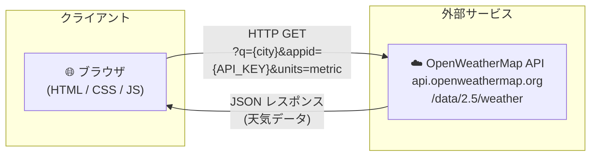
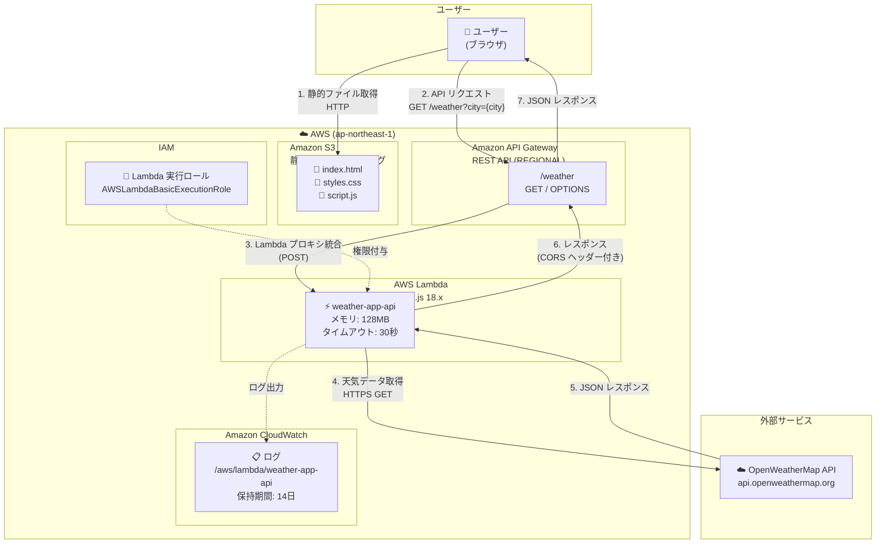
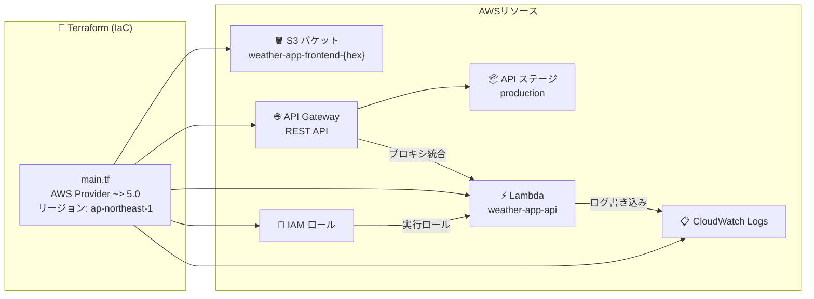
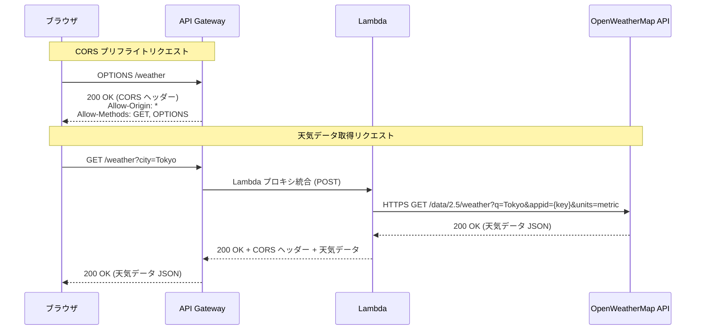
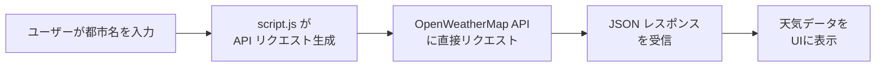
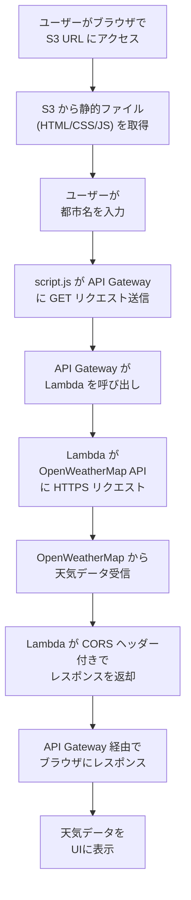

# アーキテクチャ図

天気予報ウェブアプリケーションのアーキテクチャドキュメントです。  
本プロジェクトは、**スタンドアロン版**と**AWS版**の2つの構成を持っています。

---

## 目次

1. [プロジェクト概要](#プロジェクト概要)
2. [スタンドアロン版アーキテクチャ](#スタンドアロン版アーキテクチャ)
3. [AWS版アーキテクチャ](#aws版アーキテクチャ)
4. [コンポーネント説明](#コンポーネント説明)
5. [データフロー](#データフロー)
6. [ファイル構成](#ファイル構成)

---

## プロジェクト概要

本プロジェクトは、[OpenWeatherMap API](https://openweathermap.org/api) を利用して世界中の都市の天気情報を表示するウェブアプリケーションです。

| 項目 | スタンドアロン版 | AWS版 |
|------|-----------------|-------|
| ホスティング | ローカルファイル / ローカルサーバー | Amazon S3 (静的ウェブホスティング) |
| API呼び出し | ブラウザから直接 OpenWeatherMap API | API Gateway + Lambda 経由 |
| APIキー管理 | クライアント側 (script.js に埋め込み) | サーバー側 (Lambda 環境変数) |
| バックエンド | なし | AWS Lambda (Node.js 18.x) |
| インフラ管理 | なし | Terraform (IaC) |
| デフォルトリージョン | - | ap-northeast-1 (東京) |

---

## スタンドアロン版アーキテクチャ

ブラウザから直接 OpenWeatherMap API を呼び出すシンプルな構成です。



### スタンドアロン版の特徴

- サーバー不要で動作（`index.html` をブラウザで直接開くだけ）
- APIキーはクライアント側の `script.js` に埋め込み
- OpenWeatherMap Current Weather Data API を使用
- レスポンシブデザイン、ダークモード対応

---

## AWS版アーキテクチャ

AWS のマネージドサービスを活用したサーバーレス構成です。  
APIキーをサーバー側で管理し、セキュリティを強化しています。

### 全体構成図



### AWS サービス関連図



### CORS リクエストフロー



---

## コンポーネント説明

### スタンドアロン版

| コンポーネント | 説明 |
|---------------|------|
| **index.html** | アプリケーションのメインHTMLファイル。検索フォーム、天気カード表示領域を定義 |
| **styles.css** | UIスタイル定義。レスポンシブデザイン、ダークモード対応 |
| **script.js** | アプリケーションロジック。OpenWeatherMap API への直接リクエスト、データ表示処理 |

### AWS版

| コンポーネント | 役割 | 詳細 |
|---------------|------|------|
| **Amazon S3** | 静的ウェブホスティング | フロントエンドファイル (HTML, CSS, JS) を配信。パブリックアクセスを有効化し、ウェブサイトホスティングを設定 |
| **API Gateway** | APIエンドポイント | REST API (REGIONAL) として `/weather` リソースを公開。GET メソッド (Lambda プロキシ統合) と OPTIONS メソッド (CORS Mock 統合) を提供 |
| **AWS Lambda** | バックエンド処理 | Node.js 18.x ランタイムで動作。入力バリデーション、OpenWeatherMap API 呼び出し、エラーハンドリング、CORSヘッダー付与を担当。メモリ 128MB、タイムアウト 30秒 |
| **IAM ロール** | 権限管理 | Lambda 実行ロール。`AWSLambdaBasicExecutionRole` ポリシーを付与し、CloudWatch Logs への書き込みを許可 |
| **CloudWatch Logs** | ログ管理 | Lambda 関数の実行ログを保存。ロググループ `/aws/lambda/weather-app-api`、保持期間 14日 |
| **Terraform** | インフラ管理 | IaC (Infrastructure as Code) で全 AWS リソースを管理。バージョン >= 1.0.0、AWS Provider ~> 5.0 |

### 外部サービス

| サービス | 用途 |
|---------|------|
| **OpenWeatherMap API** | 天気データの提供元。Current Weather Data API (`/data/2.5/weather`) を使用。無料枠: 60リクエスト/分、1,000,000リクエスト/月 |

---

## データフロー

### スタンドアロン版



1. ユーザーが検索フォームに都市名を入力し、検索を実行
2. `script.js` が OpenWeatherMap API へ直接 HTTP GET リクエストを送信
3. APIからJSON形式の天気データを受信
4. 受信したデータをパースし、UIに表示（気温、湿度、風速、体感温度、視程）

### AWS版



1. ユーザーがブラウザで S3 の静的ウェブサイト URL にアクセス
2. S3 からフロントエンドファイル (HTML, CSS, JS) をダウンロード
3. ユーザーが都市名を入力し、検索を実行
4. `script.js` が API Gateway の `/weather?city={cityName}` に GET リクエストを送信
5. API Gateway が Lambda プロキシ統合で Lambda 関数を呼び出し
6. Lambda が環境変数の API キーを使用して OpenWeatherMap API に HTTPS リクエスト
7. OpenWeatherMap API から天気データ (JSON) を受信
8. Lambda が CORS ヘッダーを付与してレスポンスを返却
9. API Gateway 経由でブラウザにレスポンスが返される
10. フロントエンドが天気データをUIに表示

### エラーハンドリングフロー

Lambda 関数では以下のエラーハンドリングを実施:

| OpenWeatherMap レスポンス | Lambda の返却ステータス | ユーザーへのメッセージ |
|--------------------------|----------------------|---------------------|
| 200 OK | 200 | 天気データを表示 |
| 401 Unauthorized | 500 | Weather service authentication failed |
| 404 Not Found | 404 | City not found |
| 429 Too Many Requests | 429 | Rate limit exceeded |
| その他のエラー | 502 | Unexpected response |
| 接続エラー / タイムアウト | 503 | Unable to fetch weather data |

---

## ファイル構成

```
test2/
├── ARCHITECTURE.md              # 本ドキュメント（アーキテクチャ図）
├── index.html                   # スタンドアロン版 - メインHTML
├── styles.css                   # スタンドアロン版 - CSSスタイル
├── script.js                    # スタンドアロン版 - JS (OpenWeatherMap API直接呼び出し)
├── README.md                    # スタンドアロン版 - ドキュメント
└── aws/                         # AWS版
    ├── architecture.drawio      # Draw.io形式のアーキテクチャ図 (XML)
    ├── README.md                # AWS デプロイガイド
    ├── frontend/                # S3 にデプロイするフロントエンドファイル
    │   ├── index.html           #   メインHTML
    │   ├── styles.css           #   CSSスタイル
    │   └── script.js            #   JS (API Gateway 経由で天気データ取得)
    ├── lambda/                  # Lambda 関数のソースコード
    │   └── index.js             #   ハンドラー (Node.js 18.x)
    └── terraform/               # Infrastructure as Code
        ├── main.tf              #   全 AWS リソースの定義
        └── terraform.tfvars.example  # 変数設定のサンプル
```

### 各ディレクトリの役割

| ディレクトリ | 役割 |
|-------------|------|
| `/` (ルート) | スタンドアロン版のアプリケーションファイル |
| `/aws/` | AWS版の全ファイル |
| `/aws/frontend/` | S3 にデプロイする静的ファイル (スタンドアロン版と同じUI、API呼び出し先が異なる) |
| `/aws/lambda/` | Lambda 関数のソースコード (外部依存なし、Node.js 標準の `https` モジュールのみ使用) |
| `/aws/terraform/` | Terraform による AWS リソース定義 (S3, API Gateway, Lambda, IAM, CloudWatch) |
